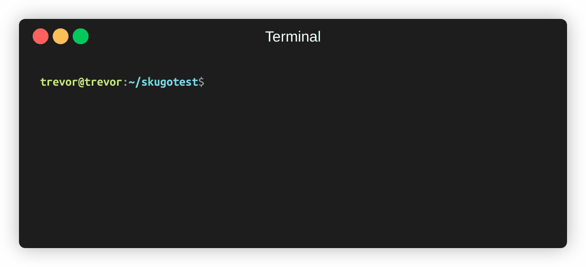
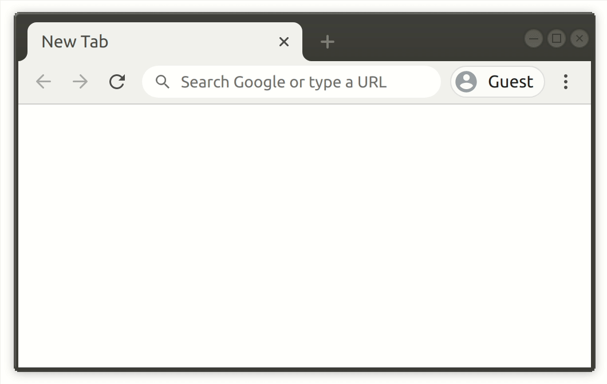

# Introducing skugo
Generate a unique shareable link and remote into a machine securely via web interface; think SSH!

[](https://travis-ci.org/TrevorSundberg/skugo)




# Running on Linux

## wget:
```
wget -qO- https://github.com/TrevorSundberg/skugo/releases/latest/download/skugo-linux-x64.tar.xz | tar xJf -
./skugo
```

## curl:
```
curl -sL https://github.com/TrevorSundberg/skugo/releases/latest/download/skugo-linux-x64.tar.xz | tar xJf -
./skugo
```

## npm:
```
npm install -g skugo
skugo
```

# How it works

To avoid the need for having a publicly visible machine or opening ports,
skugo uses WebSockets on both client browser and hosting machine to connect 
to a relay server that's hosted on [Openode](https://www.openode.io/).
Anyone who has the link will join the same session and can execute commands on the hosting machine.

# Security

Both client browser and hosting machine connect to the relay server over HTTPS (TLS/SSL).
Running skugo generates a party id using [uniqid](https://www.npmjs.com/package/uniqid) that the relay uses to identify all members of a party:

- *https<nolink>://skugo.dev/?party=**4bxj44owok5yu0vsi**#gCBKgCgbcFZPnHw1Eb3Kcw==*

The underlying protocol is encrypted with CryptoJS's AES-256. A cryptographic random 128bit pass-phrase is generated and is included as a base64 hash in the url:

- *https<nolink>://skugo.dev/?party=4bxj44owok5yu0vsi#**gCBKgCgbcFZPnHw1Eb3Kcw==***

By using the the url hash `#`, it ensures that only the client and the machine running skugo sees it.
Hashes are never sent to the relay / web server by the browser.
From there CryptoJS internally uses a key derivation function to derive a 256bit key.
This end to end encryption has two advantages:
- Even though the relay receives your data and forwards it, it cannot decrypt it (privacy)
- Assuming the relay server is compromised, the attacker cannot control your machine without breaking the encryption.

It may be obvious but needs to be said, **do not share the link with anyone you don't trust**.

# Motivation

This project was born out of frustration when trying to debug temporary build machines that you don't have the permission to SSH into or the ability to open ports. By outputting a link that can be seen on the build console, you can now quickly "SSH" into that machine and inspect it. If you find other great uses for this, let me know!

# Similar Projects
https://github.com/yudai/gotty
https://github.com/inconshreveable/ngrok

